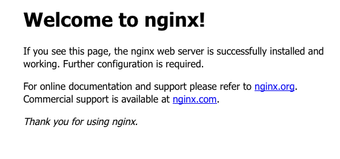

# Kubernetes Storage

## 7.1 Introduction and Overview

### 7.1.1 Containers are Ephemeral 
Microservices are all about stateless systems.  Even kubernetes itself services such as the API service, the controller and scheduler all run stateless, getting their data from [etcd](https://coreos.com/etcd/)

We can launch deployments and then go change the runing containers but when they restart, all changes are lost. 

This was the original design of kubernetes and microservices:  Applications should be stateless and state should be a service that lives elsewhere.  We've come a long way since then and Kubernetes has evolved to give us persistence.  

Let's first look at the default behavior.  Consider the case of our favorite Nginx web service.  We can start a container and expose the service: 

```
kubectl run nx --image=nginx 
kubectl expose deployment nx --port=80 --target-port=80 --type=LoadBalancer
```

Now we can visit this service in our web browser and see the normal nginx welcome screen. 



Now let's edit the pod: 

```
kubectl get pods -l run=nx
...
nx-d8f5c6d58-dt7gj ....
...
```
We can now log into it: 

```
kubectl exec -it nx-d8f5c6d58-dt7gj /bin/bash
# now on the pod
root@nx-d8f5c6d58-dt7gj:/# cd /usr/share/nginx/html/
root@nx-d8f5c6d58-dt7gj:/usr/share/nginx/html# echo "hello from this pod" > index.html
```

Refreshing the page we get: 

```
hello from this pod
```

But by deleting the pod: 
 
```
root@nx-d8f5c6d58-dt7gj:/usr/share/nginx/html# exit
kubectl delete pod nx-d8f5c6d58-dt7gj
```

And refreshing the page, we get the nginx welcome site again.  

### 7.1.2 Types of Persistence

As Kubernetes has evolved, two different ways of handling non-ephemeral storage have been created.  They are:

* Volumes
* Persistent Volumes

#### Similarities

* __Plugins__ Both volumes and persistent volumes have the idea of 'plugins' where different backends can be added.  This includes the usual public cloud suspects, Ceph, NFS, local disks, and up and coming kubernetes storage providers. Different plugins have different implementations.  Some will persist when the containers are gone, others will be destroyed. Many plugins can be used by both volumes and persistent volumes. 

* __Containers Share the Storage__ As noted, a Pod can consist of multiple containers.  Often there is only one container per pod, but in cases where multiple containers are in the same pod and need to share some type of data, these containers will share the storage volume.  

* __Predefined By Administrator__ Depending on your kubernetes environment different volume plugins will be available to users. Naturally, on a Kubernetes cluster running internally you wouldn't expect to be able to consume an AWS EBS volume. What can be used is dependent on where the pods are running.  We will talk about ways to abstract this later.

* __Many types can be used at the same time__ If you have a container that requires iSCSI, NFS, Ceph, and an empty filesystem then these can all be defined on the same system and used by the same pod.  While this is pretty ridiculous, its nice to know what Kubernetes is capable of doing. 

#### Differences

Let's now turn our attention to aspects that are unique to volumes and persistent volumes.

##### Volumes

* Volumes are defined in context of the pod.
* Volumes are meant for temporary storage to share between containers in a pod. 
* Volumes are really just a shared directory between containers in a pod.  

Let's examine a use case. [`kubeless`](https://kubeless.io) is a function as a service implementation for Kubernetes.  As part of kubeless a user will submit code that might be written in golang which can then be called from an API.  How does kubeless do this?  It uses the concept of an `initContainer`.  An `initContainer` is a container that runs a job before the main container in the pod will start running.  The `initContainer` takes the code submitted by the user and compiles it along with the preexisting code the container has.  It uses the `emptydir` plugin which takes a local directory on the node the pod is placed on and compiles into that directory.  Next the runtime container takes the compiled code and executes it as its main command.  The volume is only required for the lifetime of the pod.  

##### Persistent Volumes

* Defined outside the context of a Pod
* Persistent volumes are for all other use cases.  
* Databases, stateful applications, etc.  An example would be a MySQL cluster that can be used for an application.  
* Stateful Sets: Our old friend the WordPress blog can be hosted in a Kubernetes and make use of a Persistent Volume. 
* Require other kubernetes constructs: Storage Classes, Persistent Volume Claims

How these volumes are used are what we'll go into next. 

